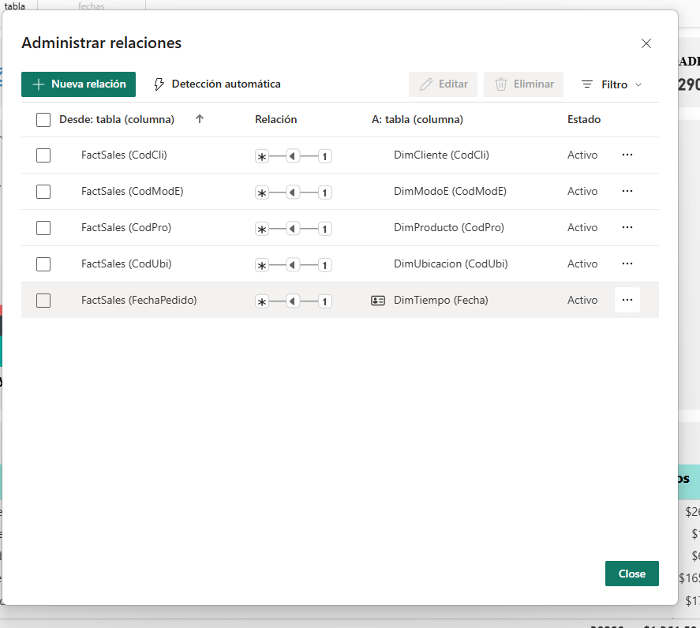

# 📊 01. Informe Básico de Ventas

## 📝 Objetivo del Dashboard

Este proyecto es un **análisis fundamental del rendimiento de ventas** de una tienda minorista. El objetivo principal es ofrecer una vista consolidada de los Indicadores Clave de Rendimiento (KPIs) para evaluar la salud del negocio. Permite monitorear las **ventas, el beneficio y las órdenes** segmentadas por variables demográficas y de producto.

---

## ✨ Visualización del Dashboard

El informe está diseñado para ser conciso y visual, enfocándose en la tendencia temporal de los ingresos y la distribución de las órdenes por categoría.

> **Dashboard Principal**
> 

---

## 🔍 Aspectos Técnicos Destacados

Este proyecto implementa buenas prácticas de Business Intelligence, desde el modelado hasta la definición de métricas clave.

### Modelado de Datos (Star Schema)

El modelo utiliza un esquema estrella (Star Schema) con una tabla de hechos principal (`FactSales`) y cuatro tablas de dimensión (`DimCliente`, `DimProducto`, `DimUbicacion`, `DimTiempo` y `DimModoE`), lo que garantiza un rendimiento óptimo de las consultas.

> **Modelo de Datos (Star Schema)**
> 

Todas las relaciones son de tipo **Uno a Varios (1:N)**, asegurando que los filtros fluyan correctamente de las dimensiones a la tabla de hechos.

> **Relaciones 1:N**
> 

### Fórmulas DAX Clave

Se crearon las siguientes medidas explícitas para calcular los KPIs principales:

| Métrica | Fórmula DAX | Descripción |
| :--- | :--- | :--- |
| **Beneficio** | `Beneficio = SUM(FactSales[Beneficio])` | Suma total de los beneficios obtenidos. |
| **Clientes** | `Clientes = COUNT(DimCliente[IDCliente])` | Conteo de clientes únicos en el período. |
| **Ingresos** | `Ingresos = SUM(FactSales[Ventas])` | Suma total de las ventas (ingresos brutos). |
| **Órdenes** | `Ordenes = DISTINCTCOUNT(FactSales[IDOrden])` | Conteo de órdenes de compra únicas procesadas. |
| **Unidades** | `Unidades = SUM(FactSales[Cantidad])` | Suma de todas las unidades de producto vendidas. |

---

## 🔗 Enlaces

* [Archivo Power BI (PBIX)](./Informe Basico de Ventas.pbix)
