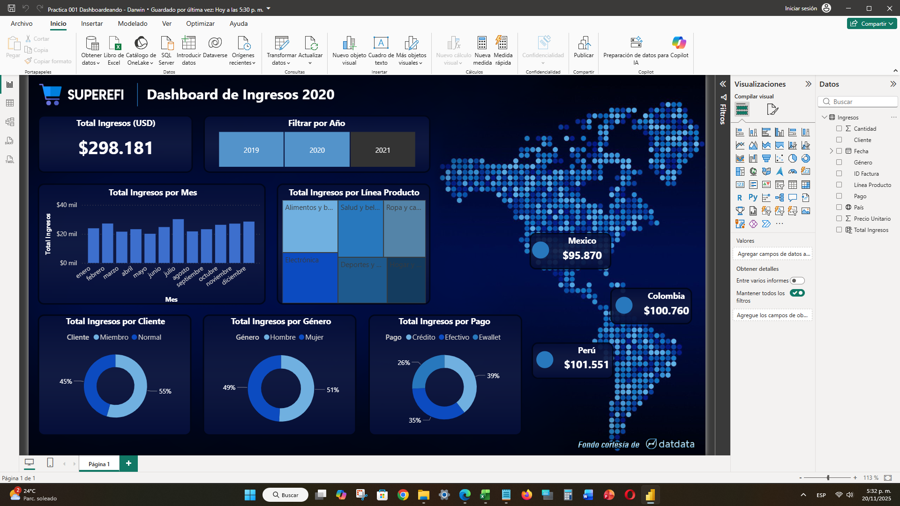
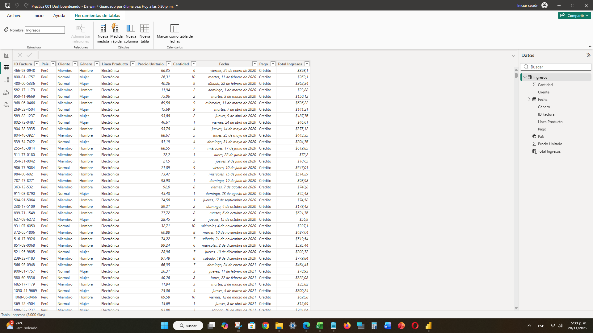

# 📉 02. Práctica de Dashboarding (Ingresos 2020)

## 📝 Objetivo del Dashboard

Este proyecto se enfoca en la **visualización avanzada y el diseño de la interfaz de usuario (UI)** para un informe financiero. El objetivo es presentar los datos de ingresos de manera altamente estética y funcional, utilizando un tema oscuro y mapas geográficos para la distribución de ventas. El dashboard permite analizar el rendimiento por año, mes, línea de producto, tipo de cliente, género y método de pago.

---

## ✨ Visualización del Dashboard

El diseño prioriza la jerarquía visual con KPIs claros, gráficos de tendencias y el uso de un mapa para mostrar la contribución de los ingresos por país.

> **Dashboard Principal de Ingresos 2020**
> 

---

## 🔍 Aspectos Técnicos Destacados

Este proyecto se centra en la limpieza de datos y la creación de medidas básicas a partir de una estructura de datos plana.

### Fuente y Estructura de Datos

A diferencia del proyecto anterior, este informe se construyó a partir de una **única tabla plana (`Ingresos`)** que contiene tanto los datos de hechos como los atributos dimensionales (Cliente, Género, País, etc.).

> **Vista de Datos (Tabla Plana)**
> 

### Fórmulas DAX Clave

La métrica principal del dashboard es una **Columna Calculada** simple utilizada para definir la métrica de Ingresos Total.

| Métrica | Fórmula DAX | Tipo | Descripción |
| :--- | :--- | :--- | :--- |
| **Total Ingresos** | `Total Ingresos = ([Precio Unitario] * [Cantidad])` | Columna Calculada | Cálculo directo del ingreso por transacción, usado como base para todos los demás cálculos del dashboard. |

### Diseño y Visualización

* **Tema Oscuro:** Uso de una paleta de colores de alto contraste para un impacto visual moderno.
* **Segmentación Geográfica:** Implementación de visualización de mapa para mostrar la distribución de ingresos en México, Colombia y Perú.
* **Segmentación Temporal:** Inclusión de botones de filtro por año para análisis rápidos de tendencias.

---

## 🔗 Enlaces

* [Archivo Power BI (PBIX)](./Practica 001 Dashboarding.pbix)
