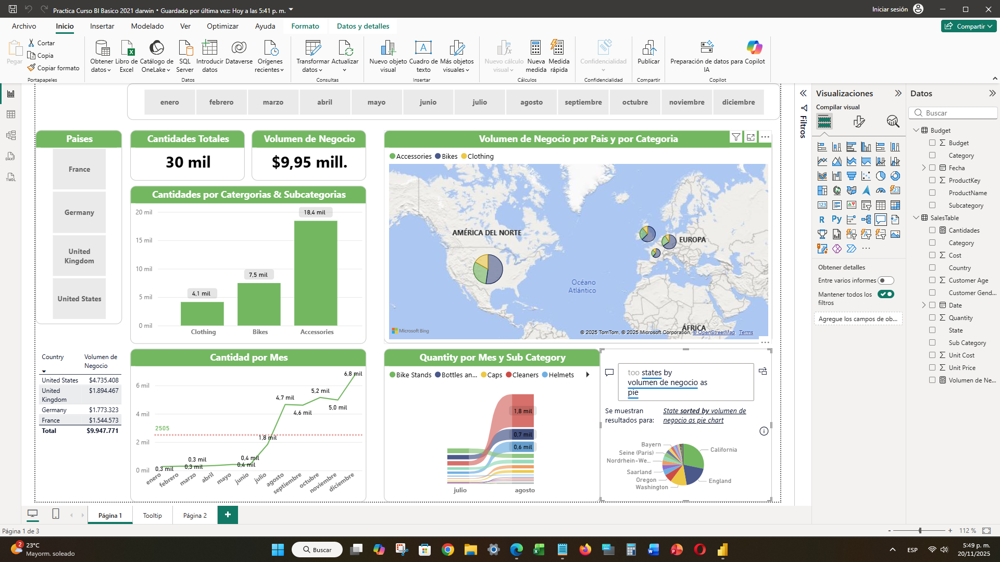
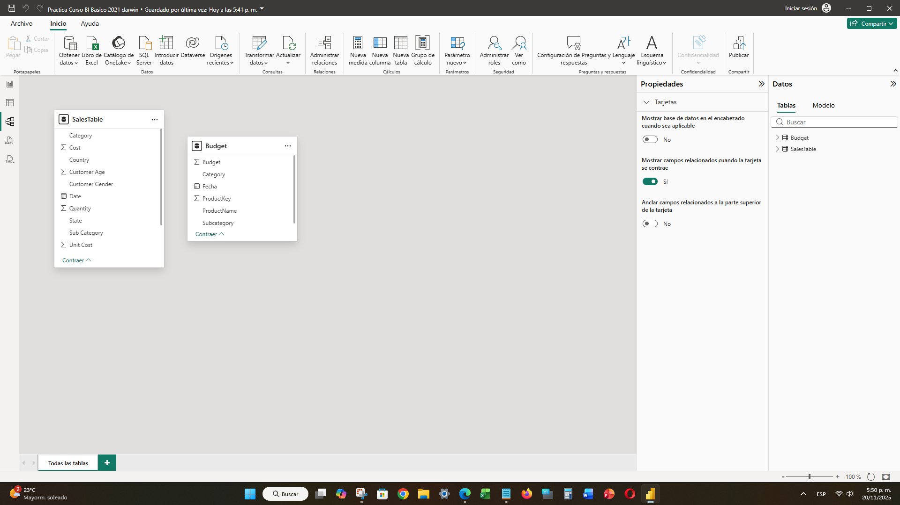

# 📚 03. Práctica de Curso Básico 2021

## 📝 Objetivo del Dashboard

Este informe representa un proyecto final de curso, centrado en demostrar el dominio de las habilidades básicas e intermedias de Power BI, incluyendo la carga de datos, el modelado simple y la creación de medidas DAX fundamentales. El dashboard ofrece una visión del rendimiento de ventas global, segmentando el **Volumen de Negocio** por país, categoría y tendencia temporal.

---

## ✨ Visualización del Dashboard

El dashboard utiliza un diseño limpio con gráficos de barras y mapas para segmentar las cantidades totales y el volumen de negocio por geografía y categoría de producto.

> **Dashboard Principal**
> 

---

## 🔍 Aspectos Técnicos Destacados

Este proyecto destaca el manejo de múltiples fuentes de datos y la creación de medidas con `SUM` y `SUMX`.

### Modelado de Datos

El modelo utiliza dos tablas principales:

1.  **`SalesTable`**: Contiene los hechos (Cantidad, Precio Unitario) y atributos relacionados con la venta.
2.  **`Budget`**: Contiene datos de presupuesto que pueden usarse para comparaciones futuras.

> **Modelo de Datos (Dos Tablas)**
> 

### Fórmulas DAX Clave

Se crearon medidas explícitas para calcular los KPIs de cantidad y valor de las transacciones:

| Métrica | Fórmula DAX | Descripción |
| :--- | :--- | :--- |
| **Cantidades** | `Cantidades = SUM(SalesTable[Quantity])` | Suma total de las unidades vendidas en todas las transacciones. |
| **Volumen de Negocio** | `Volumen de Negocio = SUMX(SalesTable, (SalesTable[Quantity]*SalesTable[Unit Price]))` | Cálculo del total de ingresos usando la función iteradora `SUMX` para multiplicar la Cantidad por el Precio Unitario fila por fila. |

---

## 🔗 Enlaces

* [Archivo Power BI (PBIX)](./Practica Curso Básico 2021.pbix)
