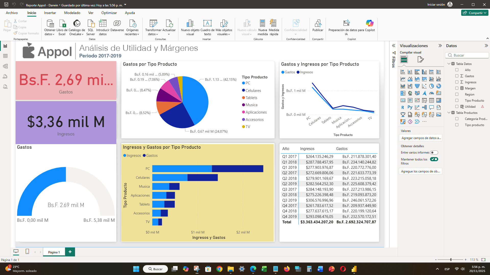
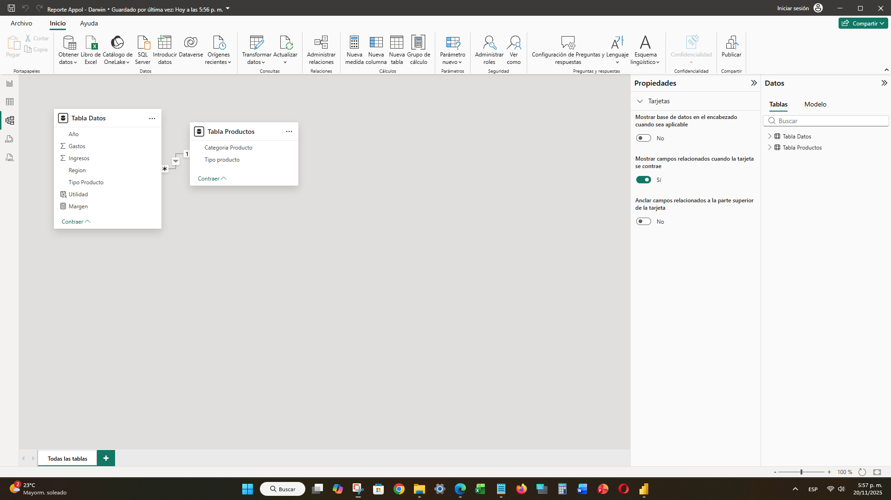

# 💰 04. Análisis de Utilidad y Márgenes (Reporte Arbol)

## 📝 Objetivo del Dashboard

Este proyecto se centra en el **análisis de la rentabilidad** de productos y servicios. El objetivo es visualizar la utilidad y el margen de ganancia en diferentes períodos y tipos de producto. El informe utiliza gráficos jerárquicos y gráficos de cascada para desglosar de forma efectiva el rendimiento financiero.

---

## ✨ Visualización del Dashboard

El dashboard presenta los KPIs clave de Gastos e Ingresos, seguido de un análisis detallado del rendimiento por Tipo de Producto a través de gráficos de pastel y de barras. La tabla de detalle permite la exploración de datos por trimestre.

> **Dashboard Principal de Análisis de Utilidad**
> 

---

## 🔍 Aspectos Técnicos Destacados

Este proyecto implementa cálculos financieros claves a nivel de DAX y un modelado simple con una tabla de hechos y una de dimensión.

### Modelado de Datos

El modelo se basa en dos tablas relacionadas:
1.  **`Tabla Datos`**: La tabla de hechos principal que contiene los valores brutos como Ingresos, Gastos y la utilidad ya calculada.
2.  **`Tabla Productos`**: Una tabla de dimensión que clasifica los productos por `Tipo producto` y `Categoría Producto`.

> **Modelo de Datos (Hechos y Dimensión)**
> 

### Fórmulas DAX Clave

Se crearon las siguientes medidas explícitas para calcular las métricas financieras:

| Métrica | Fórmula DAX | Descripción |
| :--- | :--- | :--- |
| **Utilidad** | `'Tabla Datos'[Total Ingresos] - 'Tabla Datos'[Gastos]` | Métrica de cálculo rápido que resta el total de gastos del total de ingresos para obtener la ganancia bruta. |
| **Margen** | `SUM('Tabla Datos'[Utilidad]) / SUM('Tabla Datos'[Ingresos])` | El cálculo del margen de beneficio (Utilidad / Ingresos) se realiza como una **Medida Explícita** clave para comparar la eficiencia de diferentes productos o períodos. |

---

## 🔗 Enlaces

* [Archivo Power BI (PBIX)](./Reporte Arbol.pbix)
