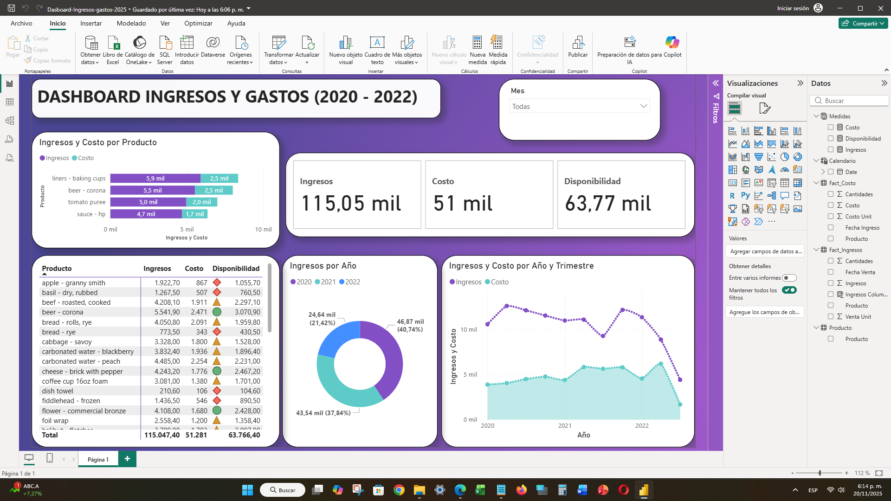
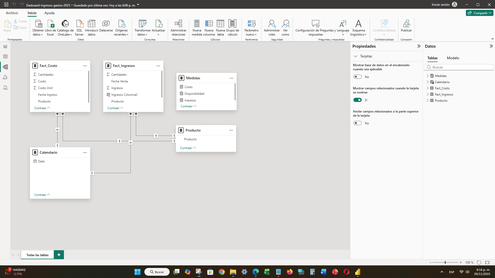

# 💰 05. Dashboard de Ingresos y Gastos (2020 - 2022)

## 📝 Objetivo del Dashboard

Este informe fue diseñado para un análisis integrado de la rentabilidad, combinando los datos de **Ingresos** y **Costos** para determinar la **Disponibilidad** (o margen bruto). El objetivo es ofrecer una vista consolidada del rendimiento del producto a lo largo del tiempo (2020-2022) y por trimestre, permitiendo la identificación de los productos más rentables.

---

## ✨ Visualización del Dashboard

El diseño presenta los KPIs centrales (Ingresos, Costo, Disponibilidad) y gráficos de tendencias de costo vs. ingreso, y distribución de ingresos por producto.

> **Dashboard Principal de Ingresos y Costos**
> 

---

## 🔍 Aspectos Técnicos Destacados

Este proyecto demuestra un modelado robusto con múltiples tablas de hechos y el uso de la función iteradora `SUMX` para crear las métricas financieras clave.

### Modelado de Datos (Modelado Complejo)

El modelo utiliza un patrón de **Hechos Múltiples**, conectando las dos tablas de hechos (`Fact_Costo` y `Fact_Ingresos`) a las tablas de dimensión (`Producto` y `Calendario`). Esto es fundamental para analizar las dos transacciones bajo los mismos filtros.

* **Fact_Costo**: Transacciones de entrada de inventario o gastos.
* **Fact_Ingresos**: Transacciones de ventas (ingresos).
* **Producto** y **Calendario**: Dimensiones comunes (Hubs).

> **Modelo de Datos Integrado**
> 

### Fórmulas DAX Clave (Iteradoras)

Se utilizaron medidas explícitas con la función iteradora `SUMX` para calcular el valor total de las transacciones antes de calcular la métrica de rentabilidad:

| Métrica | Fórmula DAX | Descripción |
| :--- | :--- | :--- |
| **Ingresos** | `Ingresos = SUMX(Fact_Ingresos, Fact_Ingresos[Cantidades] * Fact_Ingresos[Venta Unit])` | Calcula el total de ingresos multiplicando la cantidad vendida por el precio unitario, fila por fila. |
| **Costo** | `Costo = SUMX(Fact_Costo, Fact_Costo[Cantidades] * Fact_Costo[Costo Unit])` | Calcula el costo total multiplicando la cantidad de inventario por el costo unitario, fila por fila. |
| **Disponibilidad** | `Disponibilidad = [Ingresos] - [Costo]` | Métrica de utilidad/margen que resta el costo total del ingreso total (requiere las medidas iteradoras previamente definidas). |

---

## 🔗 Enlaces

* [Archivo Power BI (PBIX)](./Dashboard-Ingresos-gastos-7075.pbix)
