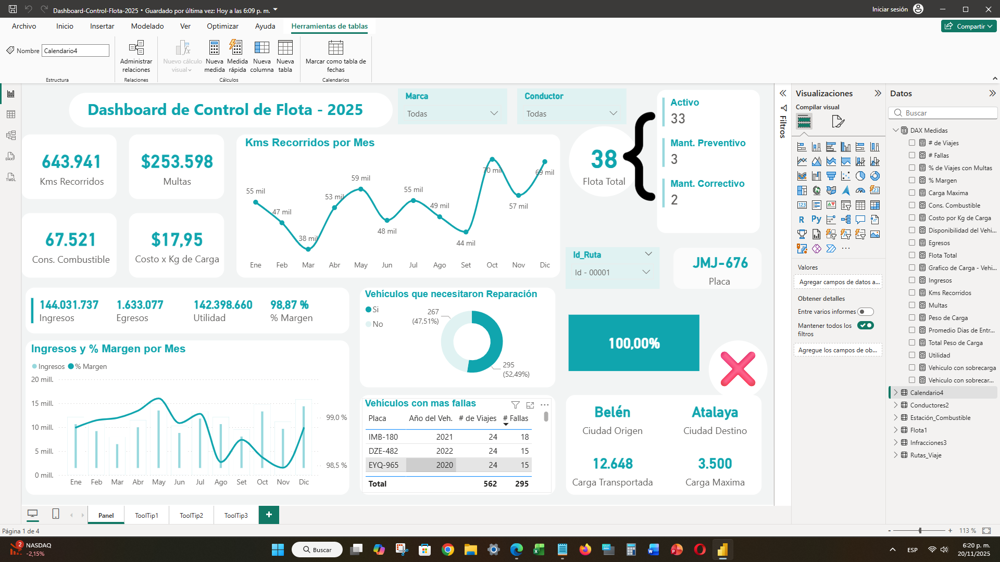
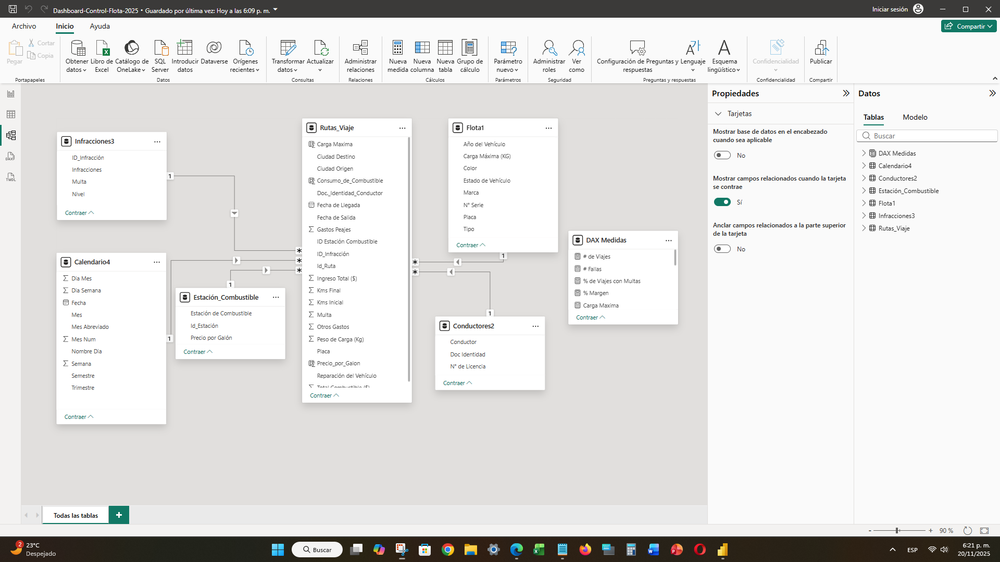

# 🚚 06. Dashboard de Control de Flota (Logística y Rendimiento)

## 📝 Objetivo del Dashboard

Este proyecto es un **Tablero de Control Operacional (Operational Dashboard)** diseñado para monitorear el rendimiento de una flota de vehículos y optimizar la gestión de recursos. El objetivo es calcular KPIs críticos de eficiencia, rentabilidad y seguridad, como el **Margen**, **Consumo de Combustible**, y la **Sobrecarga** de vehículos.

---

## ✨ Visualización del Dashboard

El dashboard presenta los KPIs financieros y operativos en la parte superior, con un desglose de Kms Recorridos, Ingresos vs. Egresos, y el estado de la Flota (Mantenimiento, Activo/Inactivo). El diseño permite identificar rápidamente vehículos con fallas o problemas de sobrecarga.

> **Dashboard Principal de Control de Flota**
> 

---

## 🔍 Aspectos Técnicos Destacados (DAX y Modelado Avanzado)

Este informe es el más avanzado del portafolio, utilizando un modelo de estrella clásico y un gran volumen de medidas DAX complejas para manejar escenarios de múltiples gastos y cálculos de eficiencia.

### Modelado de Datos (Modelo de Estrella con Múltiples Dimensiones)

El modelo está construido con una tabla de hechos central (`Rutas_Viaje`) conectada a varias tablas de dimensión para el análisis granular (Estrella):

* **Tabla de Hechos**: `Rutas_Viaje` (Contiene todos los registros de viajes, costos, ingresos y multas).
* **Dimensiones**: `Calendario4`, `Flota1` (Vehículos), `Conductores2`, `Estación_Combustible`, e `Infracciones3`.

> **Modelo de Estrella de la Flota**
> 

### Fórmulas DAX Clave (Cálculos de Rentabilidad y Eficiencia)

Las medidas utilizadas son esenciales para la gestión de la flota:

| Métrica | Fórmula DAX | Descripción |
| :--- | :--- | :--- |
| **Ingresos** | `Ingresos = SUM(Rutas_Viaje[Ingreso Total ($)])` | Total de ingresos generados por todos los viajes. |
| **Egresos** | Uso de **VAR/RETURN** para sumar cuatro tipos de gastos (Combustible, Peajes, Otros, Multas). | Demuestra el manejo de variables DAX para consolidar múltiples categorías de gastos en una sola medida. |
| **Utilidad** | `Utilidad = [Ingresos] - [Egresos]` | Rentabilidad operativa de la flota. |
| **% Margen** | `DIVIDE([Utilidad], [Ingresos], 0)` | Porcentaje de ganancia por viaje, un KPI de eficiencia financiera. |
| **% de Viajes con Multas** | `DIVIDE(CALCULATE([# de Viajes], Rutas_Viaje[Multa] > 0), [# de Viajes], 0)` | KPI de seguridad que usa `CALCULATE` para modificar el contexto y contar solo los viajes multados. |
| **Vehículo con sobrecarga** | Uso de **VAR/RETURN** con lógica `IF` y `DIVIDE` para determinar si el peso de carga supera la capacidad máxima del vehículo (KPI de seguridad y mantenimiento). |

---

## 🔗 Enlaces

* [Archivo Power BI (PBIX)](./Dashboard-Control-Flota-2025.pbix)
