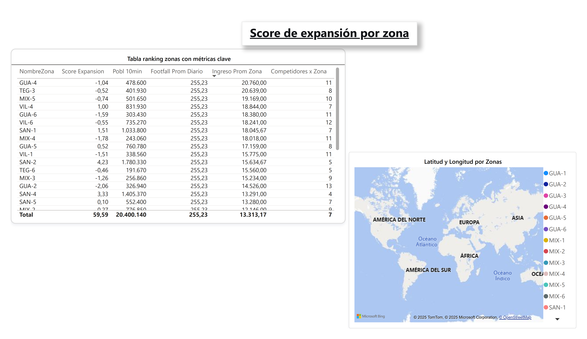
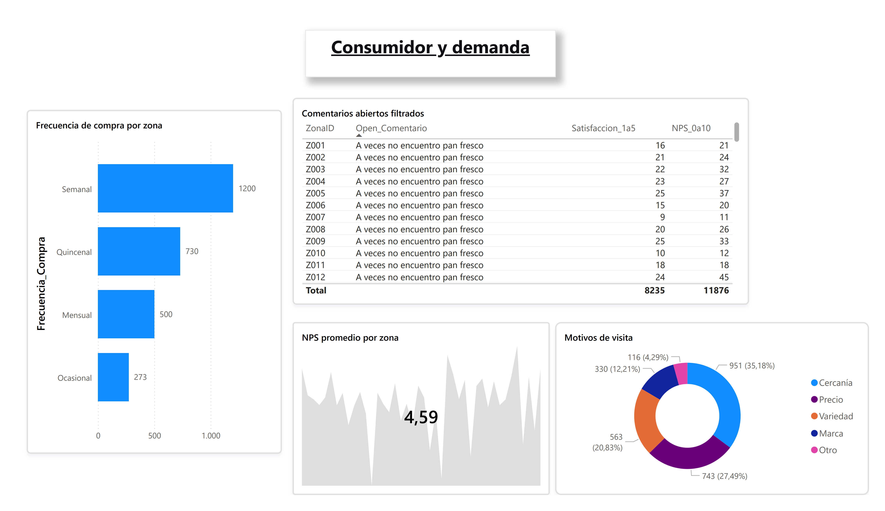
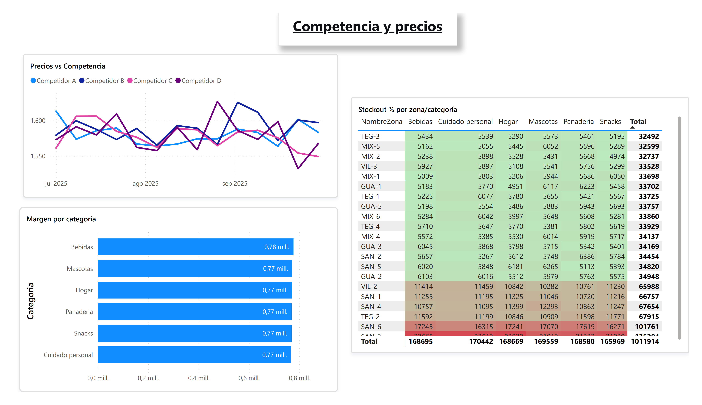

# 🏪 Proyecto 07: Análisis de Expansión Retail

## 📊 Descripción
Dashboard estratégico desarrollado como **prueba técnica** para un proceso de selección.  
Objetivo: **identificar las 3 zonas óptimas para apertura de nuevas tiendas** mediante análisis integrado de múltiples fuentes de datos.

---

## 🎯 Contexto
- **Tipo:** Prueba técnica (tiempo límite: 5 horas)  
- **Duración real:** 3.5 horas efectivas  
- **Fecha:** Noviembre 2025  
- **Entregables:** Dashboard `.pbix` + PDF exportado  
- **Estado:** ✅ Completado  

---

## 🛠️ Tecnologías
- Power BI Desktop  
- DAX (Data Analysis Expressions)  
- Power Query (ETL)  
- Modelo Estrella  
- Visualización Interactiva  

---

## 📈 Características del Dashboard

### Página 1: Decisión de Expansión

- Score multivariable por zona  
- Ranking interactivo con métricas clave  
- Mapa geográfico con potencial comercial  
- Filtro automático de zonas sin tiendas  

### Página 2: Consumidor y Demanda

- Perfil de frecuencia de compra  
- Motivos de visita  
- NPS promedio  
- Comentarios filtrados de clientes  

### Página 3: Competencia y Precios

- Evolución de precios vs competencia  
- Márgenes por categoría  
- Mapa de calor de stockouts  
- Análisis competitivo por zona  

---

## 🏗️ Arquitectura de Datos
Modelo Estrella con:
- **Dimensiones:** Calendario (central), Socioeco_Zonas (principal)  
- **Hechos:** Footfall, Ventas, Precios, Encuestas, Tiendas, Productos  
- Relaciones optimizadas para análisis cruzado  

---

## 📁 Fuentes de Datos

| Archivo                | Filas   | Descripción                          |
|-------------------------|---------|--------------------------------------|
| Socioeco_Zonas.csv      | 42      | Perfil demográfico y socioeconómico  |
| Footfall_Zonas.csv      | 92,736  | Tráfico peatonal por hora            |
| Ventas_Tiendas.csv      | 16,560  | Ventas internas por categoría        |
| Precios_Competencia.csv | 112,896 | Precios de competencia               |
| Encuesta_Consumidor.csv | 4,200   | Hábitos y satisfacción               |
| Tiendas.csv             | 30      | Tiendas existentes                   |
| Productos.csv           | 32      | Catálogo de productos                |

---

## 🎨 Decisiones de Diseño
- Score ponderado para decisión objetiva  
- Normalización de métricas para comparación justa  
- Storytelling en 3 páginas con flujo lógico  
- Formato condicional para insights rápidos  
- Filtros inteligentes (excluir zonas con tiendas)  

---

## 🔍 Insights Clave
**Top 3 zonas recomendadas:**
1. **SAN-2 (San Salvador):** Mayor población, competencia moderada  
2. **SAN-4 (San Salvador):** Baja competencia, ingresos estables  
3. **SAN-1 (San Salvador):** Alto ingreso, zona consolidada  

**Hallazgos adicionales:**
- Stockout crítico en Cuidado Personal (13.5%)  
- Oportunidad en productos saludables (demanda insatisfecha)  
- NPS promedio: 6.8/10 (área de mejora)  

---

## 🚀 Ejecución
1. Descargar `dashboard-retail.pbix`  
2. Abrir en **Power BI Desktop**  
3. Los datos de muestra están incluidos  
4. Explorar con filtros y segmentaciones  

---

## 📚 Aprendizajes
- Integración de múltiples fuentes en tiempo limitado  
- Creación de scores estratégicos multivariable  
- Storytelling con datos para decisiones ejecutivas  
- Optimización de modelos para análisis retail  

---

## 📂 Estructura del Proyecto
07_Expansion_Retail/ ├── dashboard-retail.pbix # Dashboard principal ├── README.md # Documentación ├── screenshots/ # Capturas del dashboard │ ├── pagina1-decision.png │ ├── pagina2-consumidor.png │ └── pagina3-competencia.png ├── data/ # Datos │ ├── sample/ # Datos de ejemplo │ └── data-dictionary.md # Diccionario de datos └── analysis/ # Análisis adicional └── insights.md # Insights estratégicos


---

## 🏗️ Modelo de Datos
CALENDARIO (dimensión central) ↑ SOCIOECO_ZONAS (42 zonas) ↑ FOOTFALL_ZONAS (92,736) VENTAS_TIENDAS (16,560) PRECIOS_COMPETENCIA (112,896) ↑ ↑ ↑ TIENDAS (30) PRODUCTOS (32) ENCUESTA_CONSUMIDOR (4,200)


---

## 📊 Medidas DAX Principales

```DAX
Score Expansion = 
VAR PoblacionNorm   = DIVIDE([Poblacion 10min], 100000, 0)
VAR FootfallNorm    = DIVIDE([Footfall Promedio Diario], 1000, 0)
VAR IngresoNorm     = DIVIDE([Ingreso Promedio Zona], 20000, 0)
VAR CompetidoresNorm= [Competidores por Zona]

RETURN
(PoblacionNorm * 0.3) +      // 30% Población
(FootfallNorm * 0.25) +      // 25% Tráfico peatonal
(IngresoNorm * 0.2) -        // 20% Poder adquisitivo
(CompetidoresNorm * 0.25)    // 25% Competencia (negativo)

Métricas clave:
Demográficas → Poblacion 10min, Ingreso Promedio Zona
Comportamiento → Footfall Promedio Diario
Competencia → Competidores por Zona
Consumidor → NPS Promedio, Satisfaccion Promedio
Ventas → Ventas Totales, Margen Promedio %, Stockout Promedio %


---

Este archivo ya está **formateado y listo** para pegar directamente en tu repositorio de GitHub.
