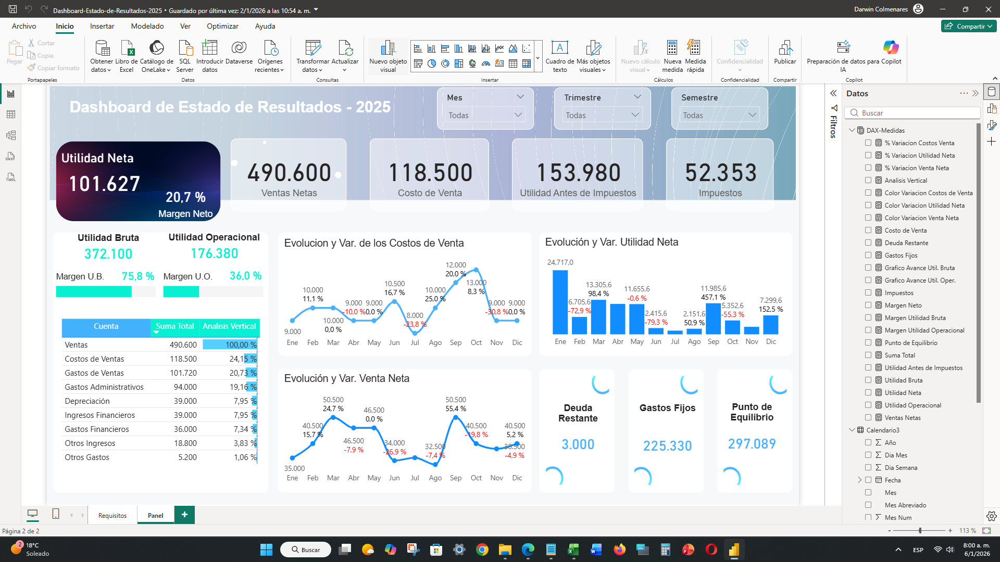
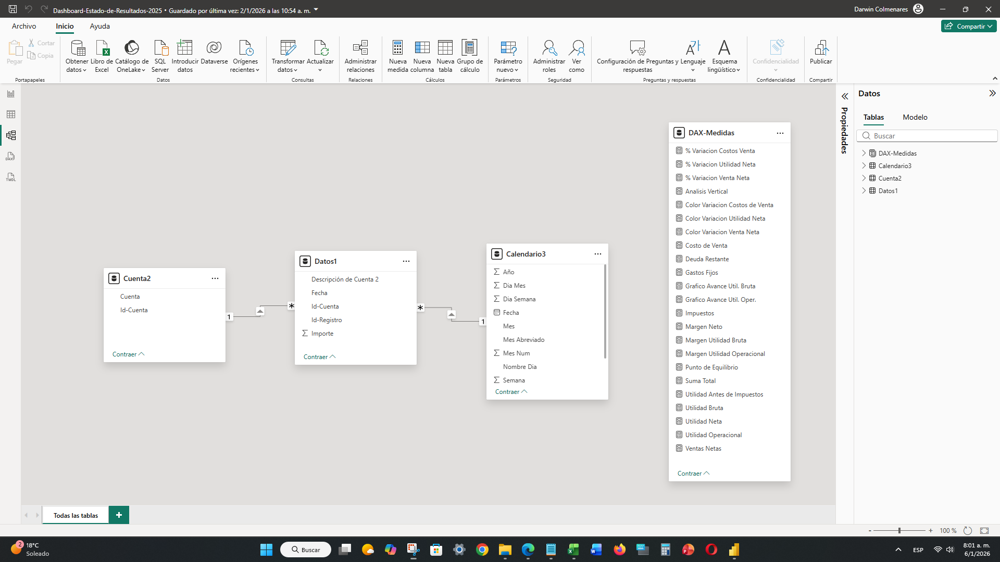

# 📊 08. Dashboard de Estado de Resultados (P&L - 2025)

## 🎯 Objetivo del Proyecto
Este dashboard financiero tiene como objetivo visualizar y analizar el **Estado de Resultados** de una organización de manera dinámica. Permite el control de métricas críticas de rentabilidad, análisis de variaciones mensuales y el cálculo de puntos de equilibrio, facilitando la interpretación de la salud financiera para la toma de decisiones.

> **Nota:** Este proyecto es una adaptación propia basada en el tutorial de **Visual Data**, ajustando la data original (2023) al contexto del año 2025.

---

## ✨ Visualización del Dashboard
El diseño está optimizado para mostrar los KPIs principales en la parte superior y un análisis detallado de la evolución de costos y ventas en el cuerpo principal.

---

## 🏗️ Modelo de Datos
El proyecto se basa en un **Esquema de Estrella (Star Schema)**, que es la mejor práctica para el rendimiento en Power BI. Este diseño permite una navegación fluida y cálculos DAX eficientes.

### Estructura del Modelo:
* **Tabla de Hechos (`Datos1`)**: Contiene todos los registros transaccionales e importes.
* **Dimensión de Cuentas (`Cuenta2`)**: Clasificación de los rubros contables (Ventas, Costos, Gastos).
* **Dimensión de Tiempo (`Calendario3`)**: Tabla de fechas personalizada para permitir análisis de Inteligencia de Tiempo.
* **Relaciones**: Relaciones de **1 a varios (*)** con filtros de dirección única para garantizar la integridad de los datos.

---

## 🛠️ Aspectos Técnicos y Habilidades
El proyecto destaca por la implementación de:
* **Análisis Vertical**: Determinación del peso porcentual de cada cuenta sobre las Ventas Netas.
* **Variaciones Mensuales**: Uso de funciones de inteligencia de tiempo para comparar el rendimiento contra el periodo anterior.
* **ETL (Power Query)**: Limpieza y transformación de datos desde tablas de origen.

---

## 📑 Fórmulas DAX Destacadas
Se crearon medidas avanzadas con lógica `VAR/RETURN` y filtros específicos por cuenta:

| Métrica | Descripción |
| :--- | :--- |
| **Utilidad Neta** | Resultado final tras deducir costos, gastos e impuestos. |
| **Impuestos** | Calculado sobre una tasa del 34% (Referencia ISLR Venezuela). |
| **Punto de Equilibrio** | Determina el nivel de ventas necesario para cubrir los gastos fijos. |
| **% Variación** | Lógica de `PREVIOUSMONTH` para análisis de tendencias. |

---

## 👤 Créditos y Referencias
* **Autor Original**: Visual Data.
* **Video Tutorial**: [Crea un Genial Dashboard de Estado de Resultados](https://www.youtube.com/watch?v=14BhMkcZPR4).

---

## 🔗 Enlaces
* [Archivo Power BI (.PBIX)](Dashboard-Estado-de-Resultados-2025.pbix)
