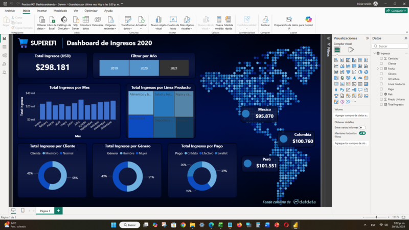
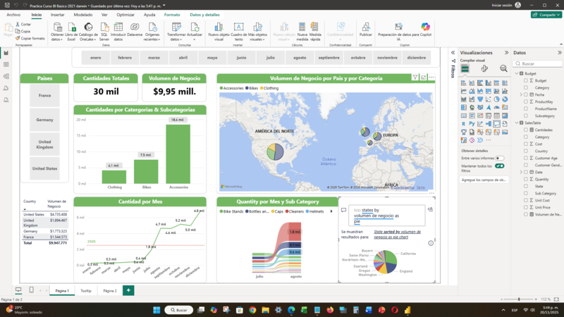
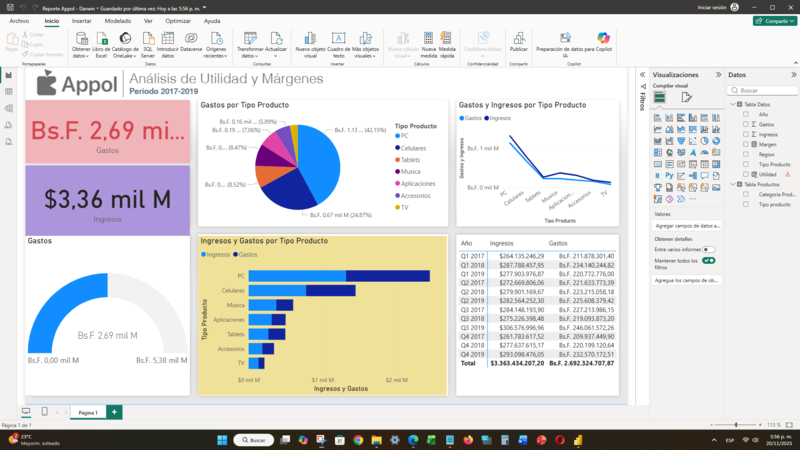
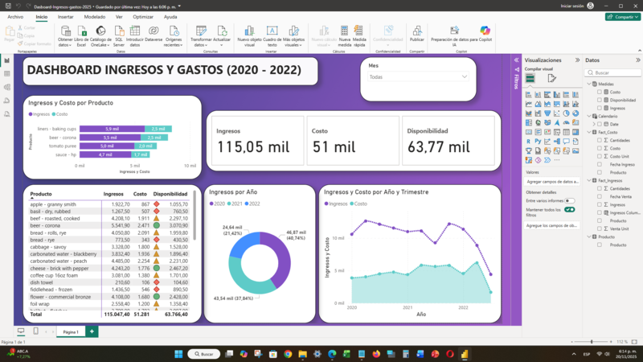
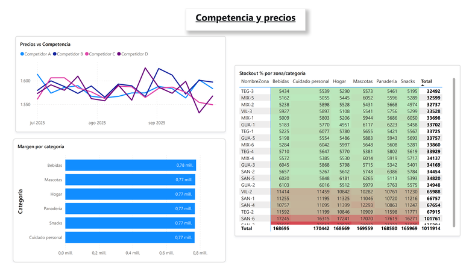
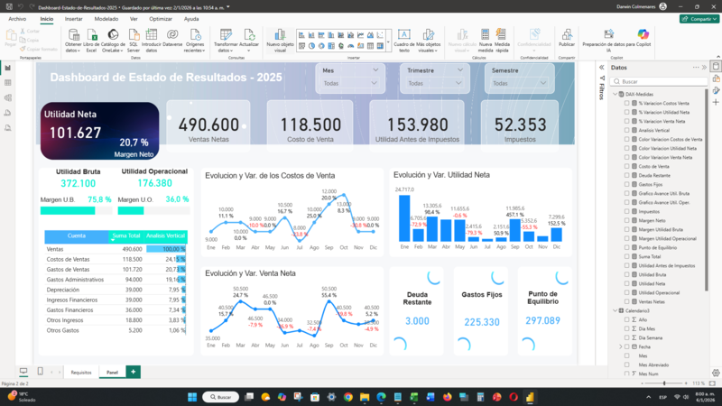

# 📈 Portafolio de Proyectos Power BI | Darwin Colmenares

¡Bienvenido a mi portafolio de Business Intelligence! Aquí encontrarás una colección de dashboards enfocados en transformar datos complejos en decisiones estratégicas. Cada proyecto incluye el archivo `.pbix` y una documentación detallada de la lógica de negocio aplicada.

---

## 🖼️ Galería de Proyectos
*Haz clic en la imagen o en el título para ver el detalle de cada informe.*

|  |  |
| :---: | :---: |
| [**01. Informe de Ventas**](./01_Informe_Ventas) | [**02. Dashboarding Avanzado**](./02_Dashboarding) |
|  |  |
| [**03. Fundamentos Power BI**](./03_Curso_Basico) | [**04. Reporte Jerárquico**](./04_Reporte_Arbol) |
|  |  |
| [**05. Control Ingresos/Gastos**](./05_Ingresos_Gastos) | [**06. Gestión de Flota**](./06_Control_Flota) |
|  |  |
| [**07. Expansión Retail**](./07_Expansion_Retail) | [**08. Estado de Resultados (P&L)**](./08_Estado_Resultados) |

---

## 📂 Descripción de los Proyectos Destacados

| Proyecto | Descripción Técnica | Acceso |
| :--- | :--- | :---: |
| **08. Estado de Resultados** | Análisis financiero P&L con enfoque en margen neto (20,7%) y punto de equilibrio. Implementa esquema de estrella y DAX avanzado. | [📂 Ver Proyecto](./08_Estado_Resultados) |
| **07. Expansión Retail** | Análisis geoespacial para la toma de decisiones sobre nuevas aperturas comerciales utilizando herramientas de mapeo. | [📂 Ver Proyecto](./07_Expansion_Retail) |
| **06. Control de Flota** | Monitoreo operativo de activos logísticos, mantenimiento y KPIs de rendimiento de transporte. | [📂 Ver Proyecto](./06_Control_Flota) |
| **01. Informe de Ventas** | Dashboard comercial enfocado en rentabilidad por producto, cumplimiento de cuotas y análisis regional. | [📂 Ver Proyecto](./01_Informe_Ventas) |

---

## 🛠️ Habilidades Técnicas
* **Modelado de Datos:** Implementación de Star Schema (Esquema de Estrella) y tablas de dimensiones/hechos.
* **DAX Avanzado:** Inteligencia de tiempo, variables (`VAR/RETURN`), y funciones de agregación complejas.
* **Visualización:** Narración de datos (Data Storytelling) y diseño centrado en el usuario final.
* **ETL:** Transformación de datos con Power Query para asegurar la integridad de la información.

---

## 👤 Contacto Profesional
¿Buscas transformar los datos de tu empresa en valor real? ¡Hablemos!

* **LinkedIn:** [Darwin Colmenares](https://www.linkedin.com/in/darwin-colmenares/)
* **Email:** [colmenaresdarwin06@gmail.com](mailto:colmenaresdarwin06@gmail.com)
* **WhatsApp:** [Enviar Mensaje Directo](https://wa.me/tu_numero_aqui)
